

<b>Trabalho de fim de curso</b>
 
--------------------fvMatrix--------------------
 
 
 
 
Curso: 
L2C - Soluções em Computação Científica  
Do Cálculo à Simulação Computacional - Fundamentos de Métodos Numéricos com Aplicações  
Turma:  
2025/2  
Professor: 
Rafael Gabler Gontijo  
Aluno: 
Edgard Wiggers
    

<b>Resumo:</b>
 
 
O objetivo deste trabalho foi a implementação em C++ dos algorítmos para solução iterativa de sistemas de equações algébricas, usando os seguintes métodos:  
Gauss-Siedel; 
Gradiente Conjugado (GC); 
Gradiente Conjugado pré-condicionado (PGC); 
Gradiente Bi-Conjugado (GBiC); 
Gradiente Bi-Conjugado pré-condicionado (PGBiC); 
Gradiente Bi-Conjugado pré-condicionado estabilizado (PGBiC-Stab).
 
 
Com o objetivo de aplicar e validar os algorítmos, foi desenvolvido um programa para gerar um sistema de equações, na forma A.X = B, baseado na discretização de um problema físico, utilizando o Método dos Volumes Finitos (FVM). Para se entender o funcionamento do programa, será feito primeiramente uma revisão do FVM, já no contexto do enunciado do problema físico que se pretende resolver.
 
 
 
 

<b>1 - Enunciado do problema físico</b>

 
Considere o escoamento de ar através de um duto unidimensional (1D), de comprimento L [m], em regime estacionário, com velocidade U [m/s], temperaturas fixadas na entrada e saída do duto, Ti [K] e To [K], respectivamente, com geração interna de calor, conforme ilustrado abaixo. Determinar a termperatura do ar ao longo do duto.
 
 
O perfil de temperatura ao longo do duto pode ser determinado analiticamente usando-se as equações 4.a ou 4.b, atentando-se para as restrições de aplicação de cada uma delas.
 
 

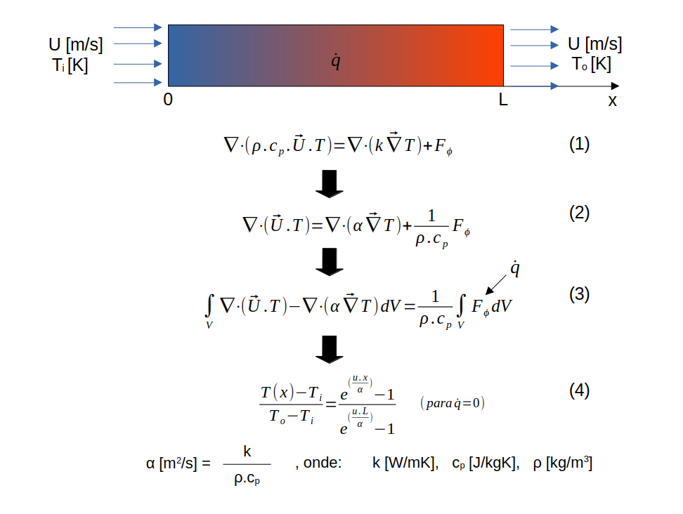

Pode-se também obter uma solução numérica, usando-se o método dos volumes finitos (FVM), através da discretização da geometria do duto em volumes de controle, onde se resolve a equação 3 em cada um dos volumes discretizados.
 
 
 
 

<b>2 - Revisão do Método dos Volumes Finitos (FVM)</b>

 
 

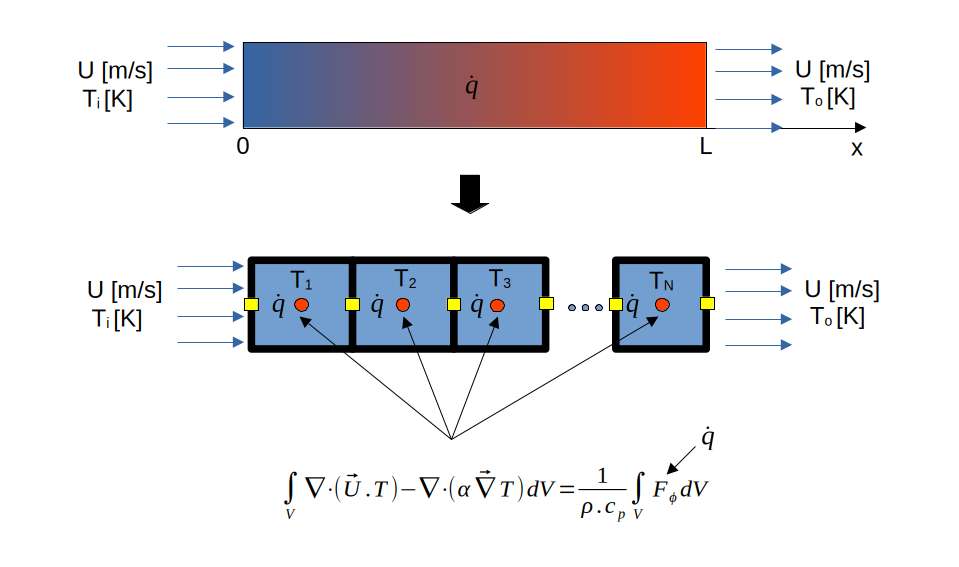

Para obter a solução numérica do problema, primeiramente aplica-se o Teorema de Gauss na equação 3 (ou equação 5, já escrita utilizando a variável genérica phi), que converte uma integral de volume em uma integral de superfície (a superfície em torno do volume, que delimita o volume). Como neste caso a malha é 1D, a integral de superfície deve ser resolvida considerando-se a superfície esquerda (subíndice "e") e a superfície direita (subíndice "d"), de cada volume de controle. A integração pelo método da quadratura de Gauss permite expressar a integral de superfície (superfície de cada face) através de um valor situado no centróide de cada face, possibilitando que a integral seja convertida em um somatório das faces. Observa-se, no entanto, que a operação de integração do volume de controle resultou em uma expressão para o cálculo dos valores da variável de interesse nas faces dos volumes de controle. Porém, necessita-se de uma expressão para cálculo da variável de interesse que utilize os valores de centróide do volume de controle. Obtem-se a expressão na forma desejada, equação 6,  utilizando esquemas de interpolação convenientes  para escrever os valores nas faces dos volumes de controle, em função dos valores de centróide dos volumes de controle. Neste caso, utilizou-se a interpolação linear (diferenças centrais), tanto para o termo advectivo, quanto para o termo difusivo. Convém ressaltar que a forma de interpolação não é única, podendo ser adotadas várias formas, em função, principalmente, do tipo de equação diferencial sendo resolvida.
 
 

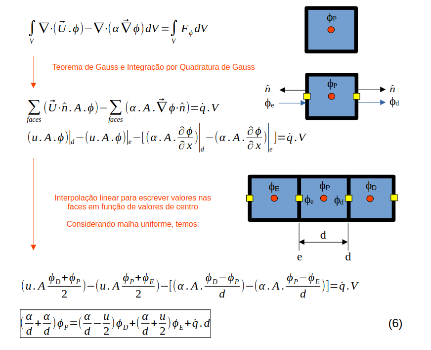

A dedução acima vale para volumes de controle no interior do domínio. No caso de volumes de controle na fronteira do dominio, ou seja, volumes de controle cuja uma, ou mais faces, formam o contorno do domínio, a equação 6 toma formas diferentes. No caso do volume de controle do lado esquerdo do duto, os valores das condições de contorno são aplicados diretamente à face esquerda do volume, cujo afastamento em relação ao centróide do volume de controle é igual a metade do comprimento do volume de controle. Analogamente, no volume de controle do lado direito do duto, os valores das condições de contorno são aplicados diretamente à face direita do volume de controle.
 
 

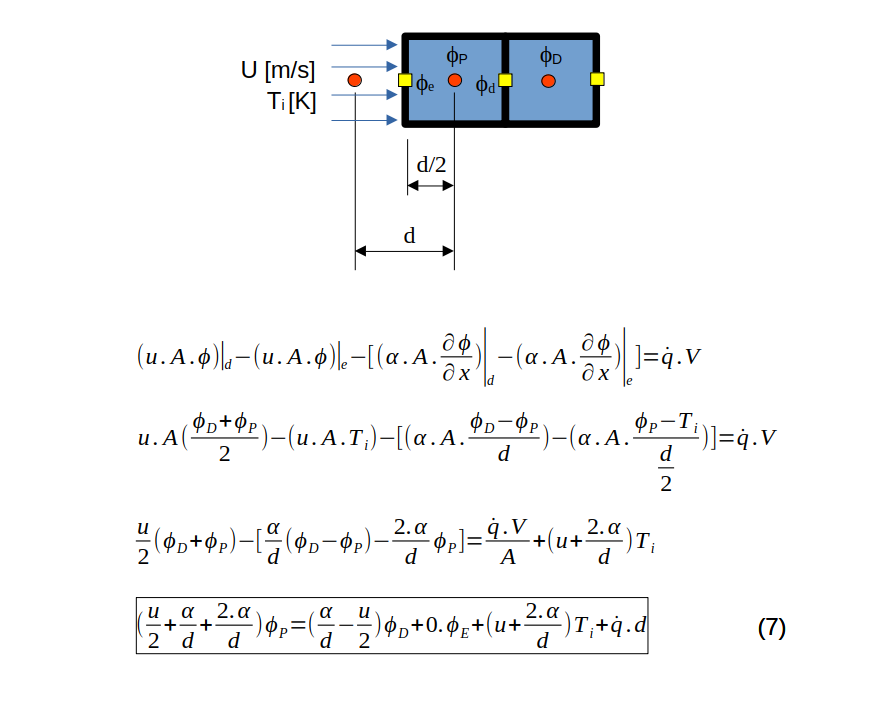

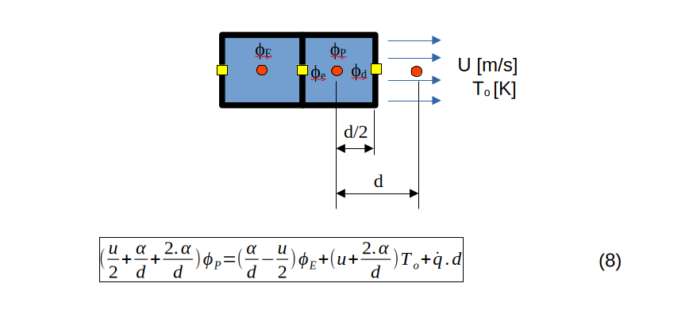

Basicamente, cada volume de controle tem uma equação algébrica associada com subindice P, que o relaciona com os volumes vizinhos, correspondendo a uma linha de um sistema de equações algébricas lineares. O volume de controle em questão tem o subindice "P, o volume à esquerda, subindice "E" e o volume a direita, subindice "D". As equações 6, 7 e 8 foram deduzidas e já colocadas na forma padrão (equação 9), o que facilita o reconhecimento dos coeficientes para montagem das matrizes. 
 
 

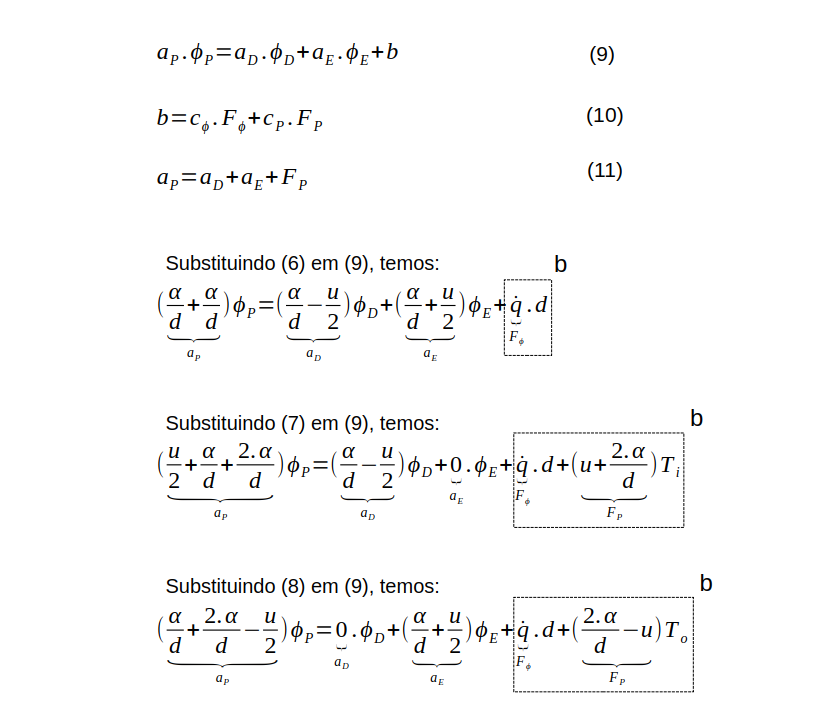

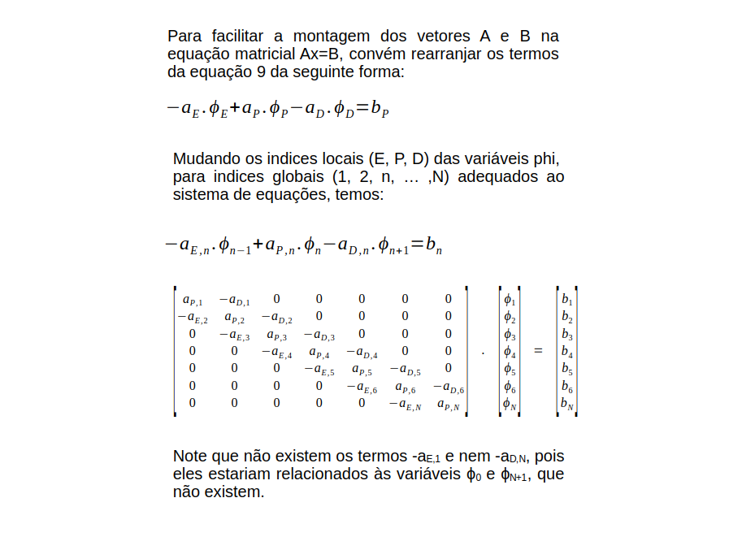
 
 
Depois de obter as equações algébricas para o cálculo da variável de interesse do escoamento, é necessário arranjar as equações na forma de um sistema linear, no formato A.X = B, montar os vetores A e B, para que então o sistema possa ser resolvido utilizando algum método numérico implementado neste repositório.
 
 
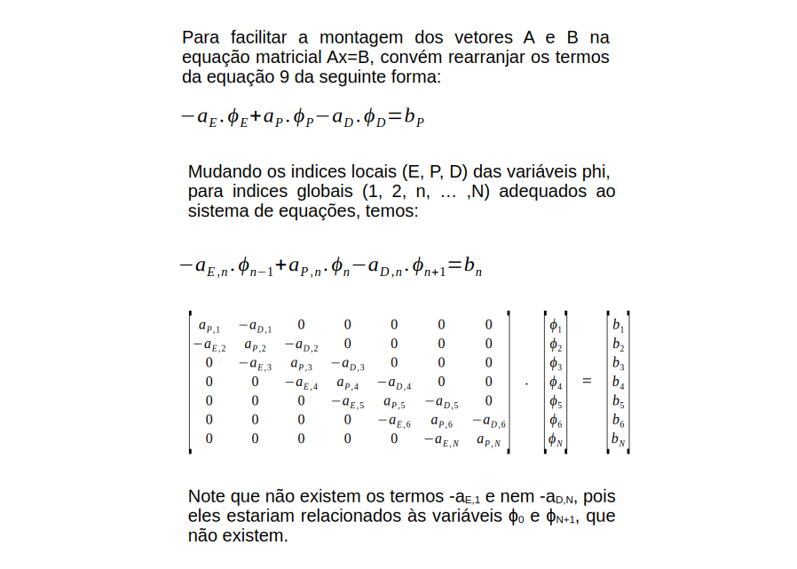

 
 
 

<b>3 - Componentes de software</b>

 
 

<b>ATENÇÃO:</b>

<b>arquivos executáveis estão em ~/fvMatrix/bin</b>

<b>arquivos fonte estão em ~/fvMatrix/src</b>

 
 
<b>1 - fvTestCase.cpp</b>
 
 
Sintaxe: 
<i>./fvTestCase [quantidade de volumes de controle] [velocidade do escoamento] [taxa de geração calor interno]</i>  
Exemplo: 
<i>./fvTestCase 100 0.1 0</i> 
  
Resultado: 100 elementos de malha (volumes de controle), velocidade do escoamento de 0.1 m/s e sem geração de calor.
  
Este programa gera os vetores "A" e "B", do sistema A.X = B e o vetor "X0" de solução inicial, a partir das equações discretizadas do problema físico descrito acima. Esses vetores são usados pelos programas de solução de sistemas lineares deste repositório. Além disso, é gerada a solução analítica, selecionada automaticamente em função dos dados de entrada fornecidos pelo usuário.
  
Propriedades do fluido e condições de contorno são informadas no código fonte. Quando há alteração, é necessário compilar novamente.
  
Cada vez que o fvTestCase é executado, são gerados/editados os seguintes arquivos:
  
-->  A.dat - Vetor A (matriz de coeficientes). 
-->  B.dat - Vetor B (termos fonte). 
-->  X0.dat - Vetor X0 (solução inicial). 
-->  r.dat - Coordenadas (afastamentos) dos centróides dos volumes de controle, ao longo do duto. 
-->  solAnalitica.dat - Solução analítica do escoamento através do duto (pares r,T). Está no formato apropriado para ser usado no GNUPlot.
 
 
 
 
<b>2 - gaussSiedel.cpp</b>  
Sintaxe: 
<i>./gaussSiedel [coeficiente de relaxação lambda] - default: lambda = 1</i>
  
Exemplo: 
<i>./gaussSiedel</i> 
<i>./gaussSiedel 0.5</i>
  
Resultado: 
<i>lambda = 1.0</i> 
<i>lambda = 0.5</i>
  
Este programa resolve o sistema A.X = B, usando o método Gauss-Siedel. A convergência do método pode ocorrer se, e somente se, a matriz "A" for diagonal dominante. A matriz "A" não precisa ser simétrica. Os dados de entrada são os vetores "A.dat", "B.dat" e X0.dat, gerados pelo usuário, ou pelo programa fvTestCase.cpp.
 
 

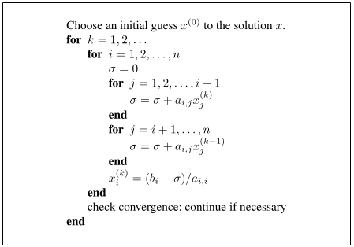

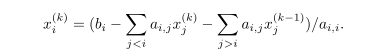

No método de Gauss-Siedel com relaxação, após o cálculo do valor atual xi(k), aplicamos uma correção do tipo:  
xi(k) = lambda xi(k) + (1-lambda) xi(k-1)  
Para lambda = 1     --> Gauss-Siedel sem relaxação 
Para 0 < lambda < 1 --> Sub-relaxação. Ajuda alguns sistemas não-convergentes a convergirem. 
Para 1 < lambda < 2 --> Sobre-relaxação. Acelera convergência de sistemas que convergem lentamente.
 
 
Cada vez que o gaussSiedel é executado, são gerados/editados os seguintes arquivos:
  
-->  X.dat - Vetor X (solução do sistema). 
-->  solNumerica.dat - Solução numérica do escoamento através do duto (pares r,X). Está no formato apropriado para ser usado no GNUPlot.
 
 
 
 
<b>3 - gradConjugado.cpp </b>  
Sintaxe: 
<i>./gradConjugado</i>
  
Este programa resolve o sistema A.X = B, usando o método do gradiente conjungado. Para tanto, é necessário que a matriz "A" seja simétrica e positivo definida. Os dados de entrada são os vetores "A.dat", "B.dat" e X0.dat, gerados pelo usuário, ou pelo programa fvTestCase.cpp. O programa fornece o vetor solução no arquivo "X.dat". 
 
 

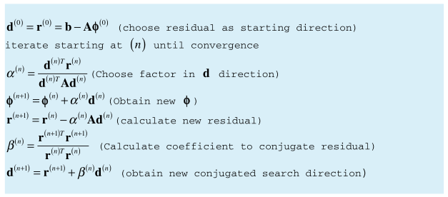
 
 
Cada vez que o gradConjugado é executado, são gerados/editados os seguintes arquivos:
  
-->  X.dat - Vetor X (solução do sistema). 
-->  solNumerica.dat - Solução numérica do escoamento através do duto (pares r,X). Está no formato apropriado para ser usado no GNUPlot.
 
 
 
 
<b>4 - gradBiConjugado.cpp </b>  
Sintaxe: 
<i>./gradBiConjugado</i>
  
Este programa resolve o sistema A.X = B, usando o método do gradiente bi-conjungado. Para tanto, é necessário que a matriz "A" seja positivo definida, porém não há necessidade de ser simétrica. Os dados de entrada são os vetores "A.dat", "B.dat" e X0.dat, gerados pelo usuário, ou pelo programa fvTestCase.cpp. O programa fornece o vetor solução no arquivo "X.dat". 
 
 

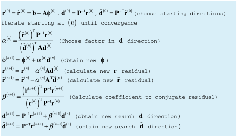
 
 
Cada vez que o gradBiConjugado é executado, são gerados/editados os seguintes arquivos:
  
-->  X.dat - Vetor X (solução do sistema). 
-->  solNumerica.dat - Solução numérica do escoamento através do duto (pares r,X). Está no formato apropriado para ser usado no GNUPlot.
 
 
 
 
