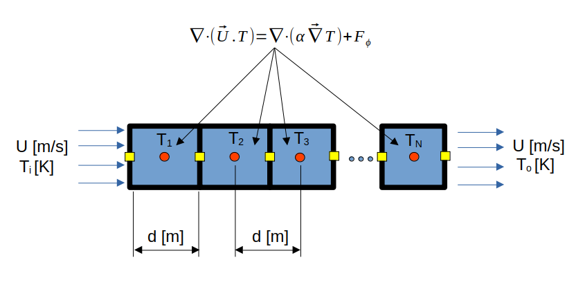

L2C - Soluções em Computação Científica   
Curso: 
Do Cálculo à Simulação Computacional - Fundamentos de Métodos Numéricos com Aplicações   
Trabalho de fim de curso

 
 
Resumo: 
 
 
O objetivo deste trabalho foi a implementação em C++ dos algorítmos para solução iterativa de sistemas lineares, usando os seguintes métodos: 
Gauss-Siedel; 
Gradiente Conjugado (GC); 
Gradiente Conjugado pré-condicionado (PGC); 
Gradiente Bi-Conjugado (GBiC); 
Gradiente Bi-Conjugado pré-condicionado (PGBiC); 
Gradiente Bi-Conjugado pré-condicionado estabilizado (PGBiC-Stab).
 
 
 

Revisão do Método dos Volumes Finitos (FVM)

 
Considere o escoamento de ar através de um duto unidimensional (1D) na direção de A para B, com velocidade U [m/s], em regime estacionário. Determinar a termperatura do ar ao longo do duto.
 
 

A discretização foi feita utilizando o método dos volumes finitos (FVM), com esquema de interpolação linear (diferenças centrais), tanto para o termo advectivo, quanto para o termo difusivo. A figura abaixo ilustra o processo.
 
 

 
 
Componentes:
 
 
1 - fvTestCase.cpp   
Este programa gera os vetores "A" e "B", do sistema Ax=B, a partir das equações discretizadas do caso ilustrado acima.
 
 
2 - gaussSiedel.cpp   
Este programa resolve o sistema Ax=B, usando o método Gauss-Siedel. A convergência do método é garatida se, e somente se, a matriz "A" for diagonal dominante. A matriz "A" não precisa ser simétrica. Os dados de entrada são os vetores "A.dat", "B.dat" e X0.dat, gerados pelo usuário, ou pelo programa fvTestCase.cpp. O programa fornece o vetor solução no arquivo "X.dat".
 
 
3 - gradConjugado.cpp   
Este programa resolve o sistema Ax=B, usando o método do gradiente conjungado. Para tanto, é necessário que a matriz "A" seja simétrica e positivo definida. Os dados de entrada são os vetores "A.dat", "B.dat" e X0.dat, gerados pelo usuário, ou pelo programa fvTestCase.cpp. O programa fornece o vetor solução no arquivo "X.dat". 
