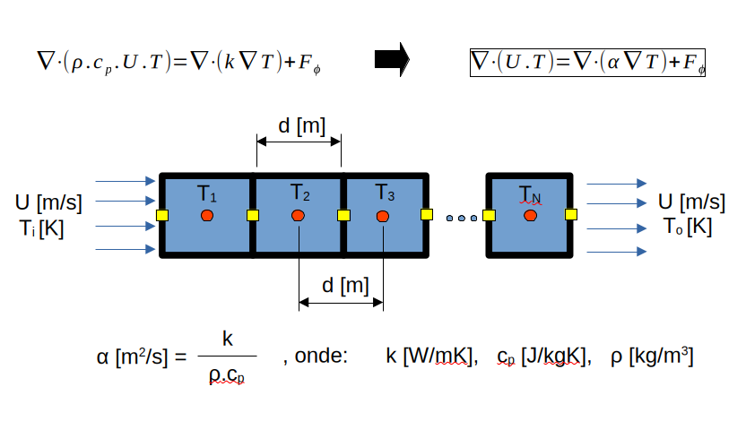

Trabalho de final de curso

 
 
Componentes:
 
 
1 - fvTestCase.cpp  

Gera os vetores "A" e "B", do sistema Ax=B, a partir das equações discretizadas do caso abaixo, obtidas pelo método de volumes finitos.
 
 

 
 
 
 
2 - gaussSiedel.cpp  

Resolve o sistema Ax=B, usando o método Gauss-Siedel. Os dados de entrada são os vetores "A.dat" e "B.dat", gerados pelo usuário, ou pelo programa fvTestCase.cpp. O vetor "X0" deve necessáriamente ser fornecido pelo usuário, tomando o cuidado de ser compatível com as matrizes "A" e "B". O programa fornece a matriz solução no arquivo "X.dat".
